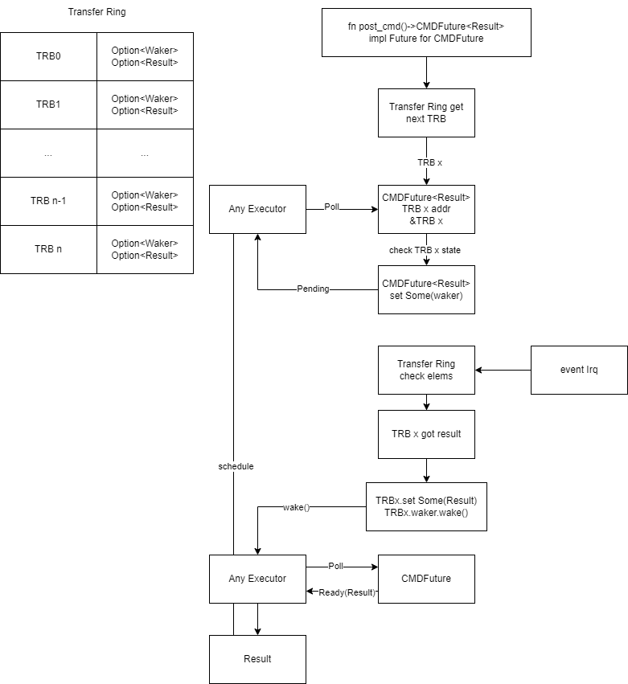

# 设计思路

## 异步模型

基于Ring的无锁设计，每个Ring元素TRB都是一个异步任务，保存异步状态，`future`通过查询`ring`来获取异步结果。

未使用特定`Executor`，且不包含任务队列，因此可以支持任意`Executor`。

`TRB`已预分配，且互不干涉，内部可以无锁访问。

对于同步系统，如`ArceOS`，在调用`async`接口时可使用`spin_on`原地轮询`poll`，等效于现有同步驱动。若支持进程`yeild`，可在`poll`遇到`Pending`时记录进程ID，并`yeild`，在中断回调中恢复相应进程。

设计图如下：

